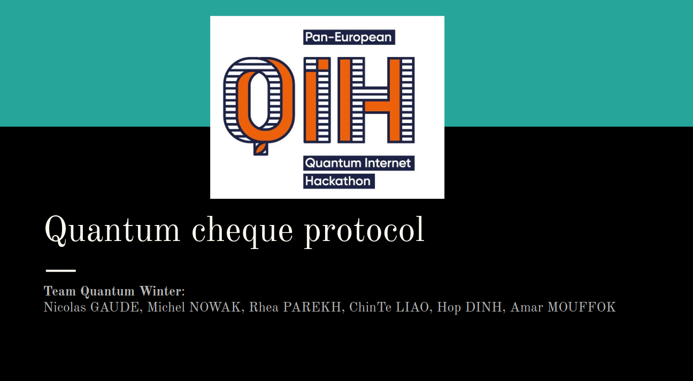

# quantumwinter



settings for simulaqron:
```
simulaqron reset && simulaqron stop && simulaqron set backend projectq && simulaqron set max-qubits 50 && simulaqron set recv-timeout 1000 && simulaqron start
```

to ensure swap_test is working :
```
python quantumwinter/swap_test.py
```

to start a cheque protocol holder Alice send M dollars using a quantum M$ cheque to Charlie through bank Bob  :
```
python quantumwinter/quantum_cheque.py
```


Team Quantum Winter:                                                                                                   - Nicolas GAUDE
- Michel NOWA
- Rhea PAREKH
- ChinTe LIAO
- Hop DINH
- Amar MOUFFOK
